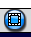

# The YASARA user interface

Open YASARA and you should see a screen that looks similar to \@ref(fig:opening).

```{r opening, echo=FALSE, warning=FALSE, message=FALSE, fig.height=2, fig.cap="The initial YASARA screen", fig.align='center'}

open <- image_read("../YASARA_guide/images/opening.PNG")

open

```

When a file is loaded it will appear in the center of the display in one of the various visualiation styles to be covered in a section \@ref(style). So far we have not learned to load a molecule or to select anything, _so do not panic!_ This chapter is one to read to start and then read again after you have read through Chapters 4 to 7. 

The next sections will orient you to the Heads-up Display (\@ref(HUD)), the command line console \@ref(console), the top Menu \@ref(Menu), and the file organization (\@ref(files)), and includes a section on where to find help (\@ref(help)).

## Heads Up Display (HUD) {#HUD}

The *Heads-up Display or HUD* in YASARA~view~ consists of two main pieces: the **Atom Properties** list and the **Scene Content** \@ref(fig:hud).

```{r hud, echo=FALSE, warning=FALSE, message=FALSE, fig.height=2, fig.cap="Heads-Up Display in YASARA. The Atom properties area is shown inside the yellow box, while the Scene Content table is shown in the red box", fig.align='center'}

open <- image_read("../YASARA_guide/images/opening.PNG")

openbox <- image_draw(open)
rect(1200, 40, 1490, 550, border = "red", lty = "dashed", lwd = 10)
rect(0, 40, 250, 600, border = "yellow", lty = "dashed", lwd = 10)

image_draw(openbox)

```

### Atom Properties
The **Atom Properties** list describes the characteristics of a selected atom. These characteristics include the identifying traits such as element, what residue:Mol:Object it is a part of, and where it is located. Further characteristics place it within the context of the molecule being displayed under the section *Bonds*. Finally, there is a section containing 3 items: *Marked Distance, Marked Angle*, and *Marked Dihedral*. These are types of measurements we will use in Chapter \@ref(measure).   

### Scene Content
The **Scene Content** table shows what models^[When I say **Model** I am referring to a file that is loaded in YASARA that displays as a molecule. The main file types that do this are .pdb, .sce, and .yob and will be covered more extensively in the next chapter] are loaded into the system. There are 5 columns in this table: *Obj, Name, Vis, Act*, and *Atom*. 

  * **Obj**: Numerical assignment of the Obj. This is a useful indentifier for commands to maniupulate the Obj.
  
  * **Name**: Indicates the name of the model. Typically this is the [PDB ID](https://www.rcsb.org/pdb/staticHelp.do?p=help/advancedsearch/pdbIDs.html), however you can rename the Object.
  
  * **Vis**: Stands for "Visible". When a file is loaded, this will default "Yes". Left-clicking with the mouse on "Yes", will change it to "No" and the model will disappear^[While the model will disappear any commands that you execute will apply the model!]. 
  
  * **Act**: Stands for "Active". When a file is loaded, this will default to "Yes". A file that is active can be manipulated and is included in the view screen if **Vis** is set to "Yes. To change this to "No" the Object must be removed from the screen \@ref(remove).
  
  * **Atom**: This column shows the number of the first atom in the Object. Like **Obj** this number can be useful for manipulating the view and other commands.
  
### Hiding the HUD

The HUD can be hid or revealed by pressing the "Insert" key. This will be important when taking screenshots or making figures as covered in Chapter \@ref(save).

## The Console {#console}

You can manipulate the view and perform analysis of the molecules in YASARA through two methods: the **Console** and the **Menu system** (\@ref(Menu)). 

The console can be accessed by pressing the Space Bar. The console will appear at the bottom of the program window as shown in Figure \@ref(fig:console). Pressing the Space Bar a second time will result in a larger console window. To hide the console, click your mouse in the program window somewhere outside of the console area.

```{r console, echo=FALSE, warning=FALSE, message=FALSE, fig.height=2, fig.cap="The console in YASARA, just another name for the command line. Left panel shows the small console window and the right panel shows the large console window", fig.align='center', fig.fullwidth=TRUE}
library(cowplot)


small <- image_read("../YASARA_guide/images/littleconsole.PNG")

big <- image_read("../YASARA_guide/images/bigconsole.PNG")

small <- ggdraw() + draw_image(small)
big <- ggdraw() + draw_image(big)

plot_grid(small, big, nrow = 1)

```

Commands are typed directly into the console in the YASARA command system or Python. You can also copy and paste into the console using the Ctrl+C followed by Ctrl+V keys. Additionally you can copy console text by hightlighting and pressing Ctrl+C. The latter activity will be a useful tool when we get to the chapter on Making Movies (\@ref(movies)). 

### Up Arrow!

If you want to repeat or edit a command that you have already executed, whether in the console or using the interactive GUI or the menus, pressing Space Bar followed by the Up Arrow copies the previous command and allows you to repeat or edit the command to tweak the outcome. In YASARA~view~ this is limited to the previous *ten commands* so if you know you are going to use a complex command again, copy it out before it is lost! 

### Tangent on using the command line and the interactive menus

Users who are new to YASARA are often hesitant to use the console to perform tasks. For my students, they report this is due to inexperience with non-GUI interfaces and a fear of not knowing what to do. ***I get it***. It took me nearly 3 years of using YASARA before I became comfortable opening the console regularly and even today, I still have issues to get the command line to work every time and to find the correct commands. 

**BUT**

knowing *how* the program makes changes to the contents of the window is valuable for understanding what happened if it is not readily apparent and if you need help, having a sense of the command that is causing problems will make finding aid easier. As you become more experienced, you might begin to find command line is more versatile and even faster (assuming you type efficiently). 

**For beginners**, start by using the menus and checking the console for the command. Then start using the console to refine choices after using the menus to make the command. Finally, as you feel confident do as much as you can using the console. 

Given the importance of computers to many scientific careers, experience working with command line will only make you more marketable and flexible in many situations.


## Menu System {#Menu}

In addition to the console, YASARA can be controlled using the Menu System which has three parts: the *Top Menu*, the *Top Row Buttons*, and the *Pop-up Menus*. 

### Top Menu

The **Top Menu** will look familiar to users who use the Microsoft suite of programs or most modern productivity software. The 8 top-level categories are shown in the green box in Figure \@ref(fig:menutree). We will explore several of this categories in more depth in later chapters. One note to make now is that the *Analyze* category is inaccessible until a molecule is loaded. This is shown as being in light grey, compared to the black of other categories. In general, if a menu category or option cannot be used under the current conditions, it will be colored grey. 

```{r menutree, echo=FALSE, warning=FALSE, message=FALSE, fig.height=2, fig.cap="Menu Bar of YASARA showing the Top Menu inside the green box and the Top row buttons inside the light blue box", fig.align='center'}

open <- image_read("../YASARA_guide/images/opening.PNG")

boxtop <- image_draw(open)
rect(0, 25, 630, 60, border = "green", lty = "dashed", lwd = 10)
rect(640, 25, 1040, 60, border = "skyblue", lty = "dashed", lwd = 10)

image_draw(boxtop)

```

### Top row buttons

The **Top row buttons** are quick ways to perform tasks such as center the view or open a new scene. The buttons are indicated by the light blue box in Figure \@ref(fig:menutree). The buttons will vary depending what version of YASARA being used however there are a few common and useful ones, which are highlighted below. 

  *  : This button allows you to select parts of a model in a box
  
  *  : This button allows you to select parts of a model in an arbitrary area which is somewhat circular. This is similar to the lasso tool seen in other programs.  
  
  *  : This button clears everything out of the YASARA window. Typically you will get a warning to avoid inadvertant loss of data.
  
  *  : This button centers the active models in the window. This really useful early on until you gain experience orienting molecules. 
  
  *  : This button rotates all the active models in the window. This button is often a source of frustrating for you when things start rotating unexpectedly. 

### Pop-up menu

```{r pop, echo=FALSE, warning=FALSE, message=FALSE, fig.height=2, fig.cap="Example of the pop-up menu in YASARA", fig.align='center'}

popm <- image_read("../YASARA_guide/images/pop-menu.png")

image_draw(popm)

```

In addition to the visible command options and readouts of YASARA like the Top Menu (\@ref(Menu)) and the HUD (\@ref(HUD)), there are ways to access commands on a selection. Referred to here as the pop-up menu (\@ref(pop)), this menu can be accessed after a selection has been made by clicking on the selection using the right mouse button. Many of the options in the pop-up menu are found with some digging through the top menu, so this pop-up menu is a fast, easy way to find some of the most used commands. The pop-up menu is only accessible with a model loaded into YASARA. 

## Where to find help {#help}

***HELP!!!!*** 

This is probably the most requested piece of information. The reason for putting this underneath all the orientation is to make getting help easier. YASARA has a specific set of words and phrases. Knowing the "jargon" of YASARA makes limiting the amount of information during a help request easier. 

### SearchDoc

The SearchDoc function can be found two ways:

Help>Search User Manual^[Remember that menu commands will be designated as Menu Category>Sub-option>Sub-sub-option>...]

**OR**

Press the Space Bar to open the console and type SearchDoc followed by the inquiry word or command.  See code chunk below for examples. 

```{r searchdoc, echo=TRUE, warning=FALSE, message=FALSE, eval=FALSE, fig.cap="Examples of using the SearchDoc command in the YASARA console"}
# Search for every help page containing the word color
>SearchDoc color

# Search for every help page referencing the word PDB
>SearchDoc PDB

```


The help page will open as a webpage in your default web browser (\@ref(fig:helpind)). This page will list every time that word or phrase appears in the YASARA documentation. 

```{r helpind, echo=FALSE, warning=FALSE, message=FALSE, fig.height=2, fig.cap="Results of using SearchDoc part 1: Initial search results", fig.align='center'}

hlpi <- image_read("../YASARA_guide/images/helpindex.PNG")

hlpp <- image_read("../YASARA_guide/images/helppage1.PNG")


image_draw(hlpi)

```

Clicking on any of the blue links will take you to the page for the command as shown in \@ref(fig:helppage). These pages have 3 parts: 

  1. The box showing information on the command
  
  2. A brief text description of the command and purpose
  
  3. Examples of how to use the command in the console or in a macro.

```{r helppage, echo=FALSE, warning=FALSE, message=FALSE, fig.height=2, fig.cap="Results of using SearchDoc part 2: The help page for the ColorBG command", fig.align='center'}

image_draw(hlpp)

```

Like this reference, the *Menu* row in the box describes where in the Menus this command is found. This is most useful early on and as you learn more about YASARA, the examples become useful too. Often you can compare what happened in your console to the examples to make sure that you are looking at the right command and using the correct arguments. 

### Help Movies

While not formally part of the help system, users can click on the *Help* category in the top menu and then choose *Play Help Movie* (Help>Play Help Movie) to access YASARA rendered movies introducing users to a variety of topics. The movies are interactive and useful for first-time users, however they are not searchable and can take a while to find a specific topic. Therefore, I recommend going through the help movies once or twice early on, but using SearchDoc as you become more experienced. 

## File system {#files}

```{r filetree, echo=FALSE, warning=FALSE, message=FALSE, fig.height=2, fig.cap="File folders created by YASARA after installation", fig.align='center'}

```

Upon installing windows, YASARA creates a series of folders similar to that shown in \@ref(fig:filetree). The number and types of folders will depend on your YASARA version, however there will be several constant folders. Unless you have another data management system, I recommend using the YASARA system to start out. When you save a file, it will go into a folder corresponding to that file type, which can save a number of beginner headaches. 

### Naming files and Data Management

While not specific to YASARA, having a good system to name and keep track of files that you create can save you many future issues. File names should be readable not only by a human but also the computer, especially if you are making a movie or executing a macro which iterates over a series of files. Therefore, some useful hints:

  1. *Use a single string when naming a file* -- 01_model_ubiquitin.pdb or 01_ModelUbiquitin.pdb not this is a file with ubiquitin.pdb  You can read spaces, but they can do funny things in a program.
  
  2. *Avoid punctuation in file names* -- the only punctuation should be between the name and the file type 01_model_ubiquitin.pdb not 1:model/ubiquitin{today}.pdb  Exceptions to this rule can be underscores (_) or dashes (-).
  
  3. *Dates or numbers can help organize your progress* -- 01_model_ubiquitin.pdb or 2018-08-01_model_ubiquitin.pdb If you use numbers make sure you use two digits even for numbers less than 10. It helps keep files in order in the file viewer. Dates can be in any format but YYYY-MM-DD is most common internationally.
  
  4. *Keep a key or notebook* -- This is will help you remember what you did along the way, but also help others who may work with or after you on the project. If you are using [Open Science Framework (OSF)](https://osf.io/) or [Github](https://github.com/) to help with your project management, then the Wiki in OSF or the Readme in GitHub are great places to provide some insight into what your files are. 
  
  5. *Never be afraid to start over* -- Sometimes you will dig a hole in your work and not be able to get out. It is okay to start over and try again. Data management takes a while to become routine, but should be a skill that you exercise often.


## Knowledge Self-Checks

Answers to questions are found in the Answers chapter under the Chapter Three header (\@ref(threekey))

  1. What action brings up the console in the YASARA window?
  
  2. What console command allows you to swap a residue?
  
  3. Where would you find the distance between to atoms?
  
  4. How can you bring up the previous command in the console?
  
  5. What is potentially problematic about the following file names?
  
      ubiquitin.pdb
      
      first model of a protein!.pdb
      
      1_model_ubiquitin.pdb