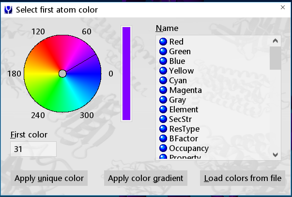
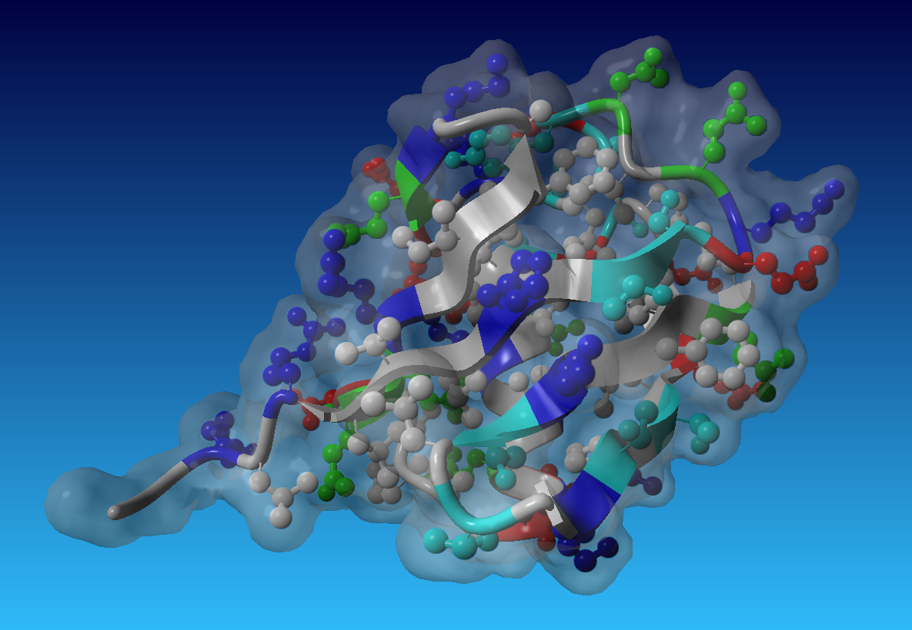
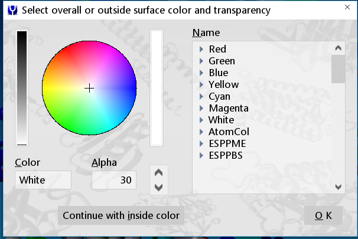
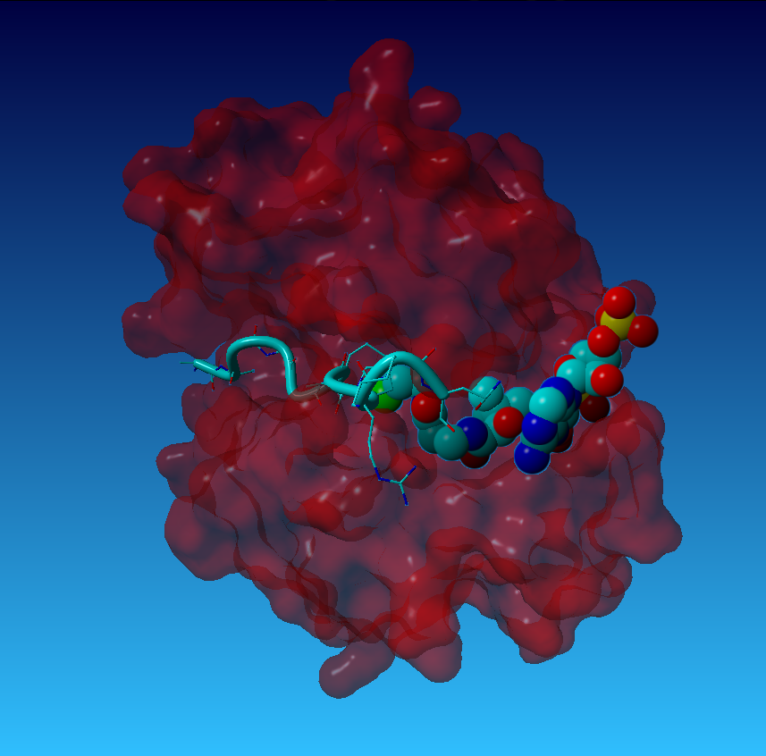

# Manipulating the model {#manipulate}

This chapter will be one of the more useful for students who are using YASARA to make professional and informative looking figures. We will cover how to Position and orient molecules manually and reproducibly (\@ref(orient)) and then stylize the molecule using different representations (\@ref(style)), colors (\@ref(colors)), and how to make surface representations (\@ref(surfaces)). Chapter 6 will cover how to label (\@ref(labels)) and change the color of your background (\@ref(background)).

## Positioning and orienting the model {#orient}

*I will focus on mouse and command line based commands. For keyboard based commands, I highly recommend watching the help movie on Working with YASARA found under Help>Play Help Movie, then select 1.1. Working with YASARA.*

Models in YASARA can be manipulated in many ways. Setting how the model is arrayed in the window is among the simplest command, but often the most difficult setting to master. Table \@ref(tab:mousetable) shows the basic mouse commands used in YASARA. If you have a three-button mouse, YASARA is very straightforward to use. However, the differences in the Mac and Windows/Linux actions with a mouse can create some issues. 


```{r mousetable, echo=FALSE, warning=FALSE, message=FALSE}
library(tidyverse)

mousedf <- tibble("YASARA action" = c("Rotate model", "Move in plane of screen", "Zoom in or out", "Select Atom", "Select Atom and Bring up pop-up menu"),
                  "Mouse Action" = c("Left + move", "Center + move", "Right + move", "Left-click on an atom", "Left-click on an atom, then right-click"),
                  "Mac Track Pad" = c("One-finger press and move", "Not available", "Two-finger press and move", "One finger click", "One-finger click then Two-finger click")
                      )

knitr::kable(mousedf,  caption = "Table of Mouse-based commands in YASARA")

```

### Making Reproducible Views

How a molecule is alinged within the viewing window is dependent on two aspects *Position* and *Orientation*. Position is the coordinates of the Obj/Mol/Res/Atom within the viewing window. In YASARA, position is described by X, Y, and Z values which are given in Angstroms and can be both positive and negative. Orientation is the rotation of the molecule in the window defined by Alpha, Beta, and Gamma angles given in units of degrees.

The orientation and position of a molecule can be found via the menus by:

Effects>Position>Get for Obj, and then select the Obj

and

Effects>Orientation>Get for Obj, and then select the Obj

For either action, the values are returned in the command line.

I find it is easier to use the command line as there is a single command that gives *both* position and orientation.

```{r posori, eval=FALSE, echo=TRUE, warning=FALSE, message=FALSE}
#Open the command line and load a test molecule from the RCSB
>LoadPDB 1UBQ, download=yes

#Retrieve the Position and Orientation
>PosOriObj 1
#Response from YASARA
PosOriObj 01, X=0.000, Y=0.000, Z=50.000, Alpha=0.000, Beta=0.000, Gamma=0.000

# You can do Pos and Ori commands separately as well
>PosObj 1
#Response from YASARA
Obj 01: X=0.000, Y=0.000, Z=50.000 A

>OriObj 1
#Response from YASARA
Obj 01: Alpha=0.000, Beta=0.000, Gamma=0.000 deg

```

The `PosOriObj` command can also set the orientation so that you can always return to the same view. This seems useless until you need to make figures such as of mutated or altered models and you want the same view for easy comparison by your reader. A simple way to change the position is the call the `PosOriObj`  command and then copy the result back into the command line which can now be edited. Once you make your changes, press enter and the model will move. One key point is that these positions and orientations are **absolute** based on the starting position of the molecule, they are not relative. So applying the same `PosOriObj` command repeatedly will produce the same orientation. 

The code chunk below shows a series of commands and Figure \@ref(fig:posoripics) shows how the molecule changes position.

```{r posorifun, eval=FALSE, echo=TRUE, warning=FALSE, message=FALSE}
#Open the command line and load a test molecule from the RCSB
>LoadPDB 1UBQ, download=yes

#Retrieve the Position and Orientation
>PosOriObj 1

#Initial position after loading
PosOriObj 01, X=0.000, Y=0.000, Z=50.000, Alpha=0.000, Beta=0.000, Gamma=0.000

#Move the model 40 A closer by changing Z
>PosOriObj 01, X=0.000, Y=0.000, Z=10.000, Alpha=0.000, Beta=0.000, Gamma=0.000

#Rotate about the Gamma axis
>PosOriObj 01, X=0.000, Y=0.000, Z=50.000, Alpha=0.000, Beta=0.000, Gamma=90.000

# Move model 10 A up, 10 A closer, rotate 20 degrees around Beta 
# and 10 degrees around Gamma axis
>PosOriObj 01, X=0.000, Y=10.000, Z=40.000, Alpha=0.000, Beta=20.000, Gamma=10.000
```

```{r posoripics, eval=TRUE, echo=FALSE, warning=FALSE, message=FALSE, fig.cap="Change in the view of the 1UBQ model using the PosOriObj commands"}
#Load images
ubone <- image_read("../YASARA_guide/images/uborigen.PNG")
ubtwo <- image_read("../YASARA_guide/images/uboritwo.PNG")
ubthree <- image_read("../YASARA_guide/images/uborithree.PNG")
ubfour <- image_read("../YASARA_guide/images/uborifour.PNG")

ubone <- image_border(image_background(ubone, "white"), "#FFFFFF", "0x80")
ubtwo <- image_border(image_background(ubtwo, "white"), "#FFFFFF", "0x80")
ubthree <- image_border(image_background(ubthree, "white"), "#FFFFFF", "0x80")
ubfour <- image_border(image_background(ubfour, "white"), "#FFFFFF", "0x80")

ubone <- ggdraw() + draw_image(ubone)
ubtwo <- ggdraw() + draw_image(ubtwo)
ubthree <- ggdraw() + draw_image(ubthree)
ubfour <- ggdraw() + draw_image(ubfour)

plot_grid(ubone, ubtwo, ubthree, ubfour,  
          align = "v", 
          hjust = c(0, 0, -0.0, -0.0),
          labels = c("Initial", "Z = 10", "Gamma = 90", "Y = 10, Z = 40, Beta = 20, Gamma = 10")) 


```

Making note of good orientations and positions by using `PosOriObj` is a huge time saver and makes your figures look more professional.

## Changing how the model looks {#style}

Scientists have several ways of looking at molecules including biomolecules. These representations provide distinct levels of information. YASARA can show the same biomolecule in different ways as well. The commands are shown in Table \@ref(tab:styletable) and Figure \@ref(fig:stylepics). Table \@ref(tab:styletable) also provides information on what information is shown with each representation. Note that when it says F4, it means the F4 function key at the top of the keyboard. Macs and modern laptops often combine the function keys with other uses so you may have to push the Fn + F4 to get it to work. Also shown in both the table and Figure \@ref(fig:stylepics) is the command line.

```{r styletable, echo=FALSE, warning=FALSE, message=FALSE}

styledf <- tibble("Style" = c("Ball", "Ball and Stick", "Stick", "Calpha Trace", "Tube", "Ribbon", "Cartoon", "Add sidechains"),
                  "Command" = c("F1 or Style Ball", "F2 or Style BallStick", "F3 or Style Stick", "F4 or Trace", "F5 or Style Tube", "F6 or Style Ribbon", "F7 or Style Cartoon", "F8 or Style Sidechain or ShowRes all"),
                  "Information conveyed" = c("van der Waal radius of atoms", "Connections between atoms", "Connections between atoms", "Location of Calpha carbon of each amino acid", "Calpha location and secondary structure", "Secondary Structure", "Secondary Structure", "Adds sidechains to the existing view. Pressing twice makes the style be BallStick"))

knitr::kable(styledf, caption = "Table of styling commands in YASARA" )

```

\

\

```{r stylepics, eval = TRUE, echo=FALSE, warning=FALSE, message=FALSE, fig.cap="Results of Style commands or Function keys in YASARA"}
ubball <- image_read("../YASARA_guide/images/ubball.PNG")
ubballstick <- image_read("../YASARA_guide/images/ballstickub.PNG")
ubstick <- image_read("../YASARA_guide/images/ubstick.PNG")
ubtrace <- image_read("../YASARA_guide/images/ubtrace.PNG")
ubribbon <- image_read("../YASARA_guide/images/ubribbon.PNG")
ubss <- image_read("../YASARA_guide/images/ubsecstr.PNG")
ubsstwo <- image_read("../YASARA_guide/images/ubsecstrtwo.PNG")
ubside <- image_read("../YASARA_guide/images/ubsidechains.PNG")

ubball <- image_border(image_background(ubball, "white"), "#FFFFFF", "0x80")
ubballstick <- image_border(image_background(ubballstick, "white"), "#FFFFFF", "0x80")
ubstick <- image_border(image_background(ubstick, "white"), "#FFFFFF", "0x80")
ubtrace <- image_border(image_background(ubtrace, "white"), "#FFFFFF", "0x80")
ubribbon <- image_border(image_background(ubribbon, "white"), "#FFFFFF", "0x80")
ubss <- image_border(image_background(ubss, "white"), "#FFFFFF", "0x80")
ubsstwo <- image_border(image_background(ubsstwo, "white"), "#FFFFFF", "0x80")
ubside <- image_border(image_background(ubside, "white"), "#FFFFFF", "0x80")

ubball <- ggdraw() + draw_image(ubball)
ubballstick <- ggdraw() + draw_image(ubballstick)
ubstick <- ggdraw() + draw_image(ubstick)
ubtrace <- ggdraw() + draw_image(ubtrace)
ubribbon <- ggdraw() + draw_image(ubribbon)
ubss <- ggdraw() + draw_image(ubss)
ubsstwo <- ggdraw() + draw_image(ubsstwo)
ubside <- ggdraw() + draw_image(ubside)

plot_grid(ubball, ubballstick, ubstick, ubtrace, ubribbon, ubss, ubsstwo, ubside, 
          labels = c("Ball", "Ball and Stick", "Stick", "Trace", "Tube", "Ribbon", "Cartoon", "Cartoon with Sidechains"),
          hjust = c(0, 0,0,0,0,0,0,0),
          scale = 0.9,
          vjust = 0.95,
          align = "hv",
          label_size = 12)

```

### Stylizing individual amino acids

It is possible to take the views in Figure \@ref(fig:stylepics) and apply them to a subset of amino acids or atoms in YASARA. 

From the menu, you would go:

View>Style atoms>*Select Style you want to use*>*Select organization level (Obj, Res, Atom)*, then make your choices in the menu that follows. 

An example set of commands are shown below.

```{r indstyle, echo=TRUE, warning=FALSE, message=FALSE, eval=FALSE}
#Load 1UBQ from the RCSB
>LoadPDB 1ubq, download=yes

#Style entire molecule as ribbon
>Style Ribbon

# Show the Lysine amino acids and style them as Ball
>ShowRes lys
>BallRes lys

```

Notice the commands for individual levels are a bit different from those of the entire scene. For depicting a part of the model in the Ball style you type `Ball` then the level of organization and then your selection. The same is true of `Stick` and `BallStick`. 

In addition, you can left-click on an atom, then right-click on the same atom to bring up the pop-up menu. Style is one of the options that you can set here and the sub-menus are similar to those above using the top menu. 

### Showing and Hiding Atoms and Amino Acids {#hide}

Sometimes you only want to see certain parts of the molecule or show sidechains for certain amino acids. This is where the `Show` and `Hide` commands are useful. As suggested by the names, these commands show or hide parts of the molecule. The code below shows several examples for each.

```{r showhide, echo=TRUE, eval=FALSE}
#Load 1UBQ from the RCSB
>LoadPDB 1ubq, download=yes

#Style entire molecule as Ball and Stick
>Style BallStick

# The red balls that are not attached to anything are water molecules
# they can be hidden
>HideRes HOH

# Style as ribbon and show the side chains
>Style Ribbon
>ShowRes all

# Hide the atoms in the sidechain
>HideAtom backbone

# Hide all of the secondary structure
>HideSecStrAll

# Show lys amino acids
>ShowRes lys


```


## Setting the Colors of the Model {#colors}

Color is one of the most effective ways of designating areas of interest within a model. For example you could color the important amino acids in an active site to make them stand out to the viewer. Setting color is a straight-forward set of steps and can be applied to all of the scene contents or just a single atom and everything in between just as with stylizing of the scene contents.

From the menu, you would go:

View>Color>*Select organization level*, then pick your Obj/Mol/Res, and pick your color as shown in the color menu in Figure \@ref(fig:colormenu). 

Once you have made your selection, click "Apply Unique Color" to apply the single color or you can apply a color gradient. The gradient option is not used frequently and the `SearchDoc` command can provide more information.

```{r colormenu, eval = TRUE, echo=FALSE, warning=FALSE, message=FALSE, fig.cap="YASARA color menu", out.width="120%"}



```

You can pick colors based on name as shown on the right side of Figure \@ref(fig:colormenu) or feature or by using the color wheel. 

Examples of using the command line method for coloring a model or parts of a model are shown below. The general format is use `Color` with your level of organization, then your target(s) to color followed by a comma and the color. The color can be described by name or number from the color wheel. Amino acids can be referred to by number, three letter code, three letter code and number. 

```{r colorcmd, echo=TRUE, warning=FALSE, message=FALSE, eval=FALSE}
#Load 1UBQ from the RCSB
>LoadPDB 1ubq, download=yes

# Color the whole object as blue
>ColorObj 1, blue

# Color only alanine amino acids as red
>ColorRes alanine, red

# Color lys 48 magenta
>ColorRes lys 48, magenta

# Color amino acids 10 to 25 in yellow
>ColorRes 10-25, yellow

# Color phenylalanine amino acids as color 45
>ColorRes Phe, 45

```

In general, using red and green in the same figure is a bad idea due to the prevalence of red-green colorblindness. Be aware of your audience when choosing colors!


### Color Wheel

The color wheel menu is shown on the left side of Figure \@ref(fig:colormenu). You can drag the line around to your favorite color or set the value in the First color box to the lower left of the color wheel. If you have a particular set of colors you want to use, the color wheel numbers are a good way to ensure reproducibility.


### Color by Element and other features

In addition to coloring models by specific colors, you can also color be specific features such as the Element or ResType. Using this type of color scheme is really effective for overview models such as finding if certain types of amino acids are clustered in a specific area or when displaying amino acid side chains and showing the colors of the elements contained therein. If you are unsure what atom or amino acid type is represented by a color, remember that you can left-click on an atom and the Atom Properties in the left of the HUD will show you the information (\@ref(HUD)). 

```{r featcolor, echo=TRUE, eval=FALSE}
#Load 1UBQ from the RCSB
>LoadPDB 1ubq, download=yes

# Show model as ribbon with sidechains
>Style Ribbon
>Style Sidechain=BallStick

# Color Obj by element
>ColorObj 1, element

# Color Obj by amino acid type
>ColorObj 1, restype

```

### Changing the color scheme

You can change the feature color schemes by:

View>Color>Parameters, then choosing the scheme (e.g. element, restype) to change, and setting your element and color. 

Only one element color can be changed at a time. You can also restore the defaults if you messed up!

## Adding a surface {#surfaces}

Surfaces are another valuable element for visualizing biomolecules. Surfaces can show pockets where ligands or substrates bind as well as the volume occupied by elements of a structure. In combination with coloring and transparency you can also create some fun looking graphics (\@ref(fig:surfaceex)).

```{r surfaceex, echo=FALSE, warning=FALSE, message=FALSE, out.width="120%", fig.cap="Surface representation of 1Ubq colored by residue type"}



```

To create a surface using the menu

View>Show surface of>*Pick your level of organization*, then choose your type of surface. The types of surfaces are:

  * **van der Waals** -- surface shows the atom radii
  
  * **Molecular** -- a smoothed combination of the model atomic radius and the surface created by rolling a water molecule over the model
  
  * **Solvent accessible** -- the van der Waals radius plus the radius of water

Typically the molecular surface is the most valuable for visualization and is the most realistic.  For more information on how the surfaces are generated use the `SearchDoc` command searching for surface or watch Help Movies 2.2, 2.3 and 2.4 in YASARA. 

In addition to the surface type you can also pick the color and transparency of the surface. The menu is shown in Figure \@ref(fig:surfmenu). The color is chosen as in Section \@ref(colors) using the words or color wheel. Alpha is the transparency value. An alpha of 100 is completely opaque while a value of 0 is completely transparent. The transparency of the surface in Figure \@ref(fig:surfaceex) was 30. An additional option is to color the inside of the surface which is general unnecessary but can be fun to experiment with.

```{r surfmenu, echo=FALSE, warning=FALSE, message=FALSE, out.width="120%", fig.cap="Surface color and transparency menu"}


```

To generate a surface using the command line you use the `ShowSurf` command as shown below. You must specific what parts of the scene to make the surface (Obj/Mol/Res/Atom), the type of surface, the `OutCol` which is the outside color, and the `OutAlpha` which is the alpha value.

```{r surfcode, echo=TRUE, eval=FALSE}
# Load 1UBQ from the RCSB
>LoadPDB 1ubq, download=yes

# Show model as ribbon with sidechains
>Style Ribbon
>Style Sidechain=BallStick

# Make a blue molecular surface over the entire object
>ShowSurfObj 1, type = molecular, Outcol = blue, OutAlpha = 100

# Make a red transparent molecular surface around all the lysine residues
>ShowSurfRes lys, type = molecular, Outcol = red, OutAlpha = 40

# Make a green transparent van der Waals surface around the obj
>ShowSurfObj 1, type = VdW, Outcol = green, OutAlpha = 20

```

### Hiding a surface

To hide all surfaces using `HideSurfAll`. 


## Knowledge Self-Check^[Answers can be found in Chapter \@ref(fivekey)]

  1. Try to re-create the image in Figure \@ref(fig:fivecheck) using PDB [1QSN](http://www.rcsb.org/structure/1QSN). You will use commands from this chapter as well as the previous chapter to make the figure. List the commands.

```{r fivecheck, echo=FALSE, warning=FALSE, message=FALSE, out.width="120%", fig.cap="Your mission, if you choose to accept it"}



```

