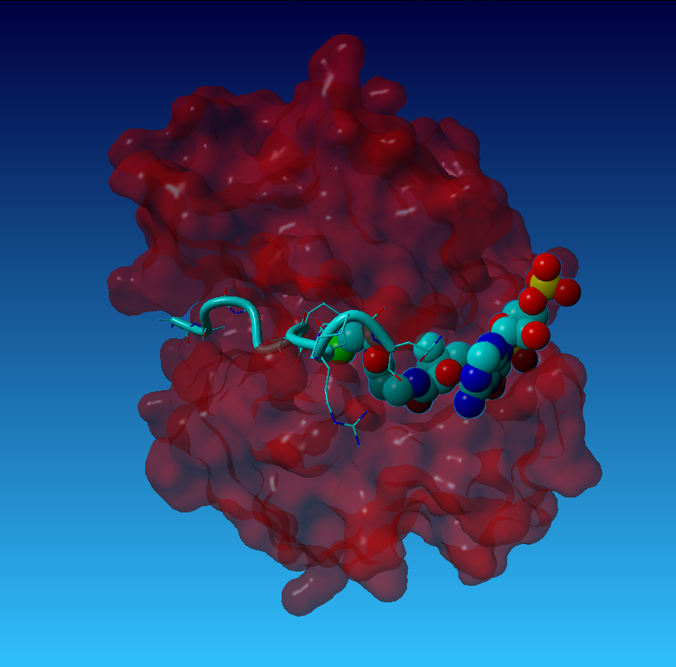

# Exercise Answers

## Chapter 3 {#threekey}

  1. What action brings up the console in the YASARA window?
  
      *Pressing the Space Bar. A second press brings up the larger console*
  
  2. What console command allows you to swap a residue?
  
      *SearchDoc swap bring up the index and with some reading you will find SwapRes is the appropriate command*
        
  3. Where would you find the distance between to atoms?
  
      *Atom Properties in the HUD. If the two atoms are connected it will be in the "Bonds" section, if you are looking between two selections, then in the "Marked Distance" row.*
  
  4. How can you bring up the previous command in the console?
  
      *Up Arrow*
  
  5. What is potentially problematic about the following file names?
  
      ubiquitin.pdb --> *Non-specific name. Not clear when it was made or what it might be*
      
      first model of a protein!.pdb --> *Spaces in the name and an !.*
      
      1_model_ubiquitin.pdb --> *first digit is a single digit not 01 which would be better for ordering in the file explorer*


## Chapter 4 {#fourkey}


  1. If you had colored a molecule and wanted to save the model and the stylizing of the model, which file types would be best?
      *.yob or .sce will include colors in the file*
  
  2. What does the asterisk (*) mean in the Filename box when loading or saving a file?
  
      *The asterisk is a wild-card operator that is replaced by the appropriate file name*
  
  3. What is the largest level of model organization in YASARA? The smallest?
  
      *Obj>Mol>Res>Atom*
  
  4. What repository contains most biomolecule models?
  
      *The RCSB which is also called the PDB or Protein Data Bank*
  
  5. What might each of the commands below do? What do they act on?
  
```{r fourcmdsans, echo=TRUE, eval=FALSE, warning=FALSE, message=FALSE}

>LoadPDB 1ubq, download=yes # Load the PDB file from the RCSB of 1ubq

>SelectAtom 100-150 # Select atoms 100 to 150 in the viewing window

>ColorObj 3 4, green # Color objects 3 and 4 green

>CountAtom Obj 2 Ala # Count the number of atoms in all of the alanine residues in Obj 2

```


## Chapter 5 {#fivekey}

```{r fiveanswers, echo=FALSE, warning=FALSE, message=FALSE, out.width="120%", fig.cap="Did you make it?"}



```

```{r fiveanswerscmd, echo=TRUE, eval=FALSE}
#Load PDB
>LoadPDB 1qsn, download=yes

# Position and Orient the molecule
>PosOriObj 01, X=0.000, Y=0.000, Z=75, Alpha=45, Beta=190, Gamma=50

# Make the surface 
>ShowSurfMol atom 1, type=molecular, OutCol = red, OutAlpha = 40

# Stylize the coenzyme A
>BallRes coa

# Show the amino acid side chains in the peptide
>ShowRes Mol B

# Hide the enzyme secondary structure
>HideSecStrMol atom 1

```

## Chapter 6 {#sixkey}